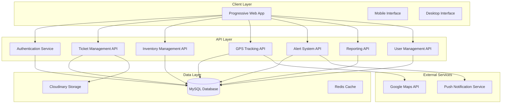

# Design Document: Technical Service Management System

## Overview

The Technical Service Management System is a comprehensive Progressive Web Application designed for ISP/telecommunications companies. The system provides multi-role authentication, real-time ticket management, equipment inventory tracking, GPS monitoring of field technicians, and comprehensive reporting capabilities.

The architecture follows a modern full-stack approach with React frontend, Node.js serverless API, MySQL database, and cloud-based file storage, optimized for Vercel deployment with scalability and professional deployment in mind.

## Architecture

### High-Level Architecture



### Technology Stack

**Frontend:**
- React 18 with TypeScript for type safety
- Redux Toolkit for state management
- React Router for navigation
- Tailwind CSS for styling with dark/light theme support
- Recharts for data visualization
- React Icons for consistent iconography
- Date-fns for date manipulation
- Axios for API communication

**Backend:**
- Node.js with Vercel serverless functions
- JWT for authentication with bcrypt for password hashing
- Zod for request validation
- CORS middleware for security

**Database & Storage:**
- MySQL (PlanetScale) for primary data storage
- Cloudinary for image storage (ticket resolution photos)
- Redis for caching and session management

**Deployment & Infrastructure:**
- Vercel for frontend and API deployment
- Progressive Web App with Service Worker
- Push notification support

## Components and Interfaces

### Authentication System

**JWT Token Management:**
```typescript
interface AuthTokens {
  accessToken: string;    // 1 hour expiration
  refreshToken: string;   // 7 day expiration
}

interface User {
  id: string;
  email: string;
  fullName: string;
  role: 'OWNER' | 'ADMINISTRATOR' | 'EMPLOYEE';
  branchId?: string;
  isActive: boolean;
  lastAccess: Date;
}
```

**Authentication Flow:**
1. User submits email/password
2. System validates credentials using bcrypt
3. Generate JWT access and refresh tokens
4. Store refresh token securely
5. Automatic token renewal before expiration
6. Role-based route protection

### Ticket Management System

**Ticket Entity:**
```typescript
interface Ticket {
  id: string;
  customerName: string;
  address: string;
  houseReference: string;
  customerId: string;
  customerTag: string;
  problemType: ProblemType;
  description: string;
  priority: 'LOW' | 'MEDIUM' | 'HIGH' | 'URGENT';
  status: 'PENDING' | 'ASSIGNED' | 'IN_PROGRESS' | 'RESOLVED' | 'CANCELLED';
  assignedTo?: string;
  createdBy: string;
  createdAt: Date;
  updatedAt: Date;
  resolutionNotes?: string;
  resolutionPhotos: string[];
}

enum ProblemType {
  INTERNET_RECONNECTION = 'Internet Reconnection',
  TV_RECONNECTION = 'TV Reconnection',
  SERVICE_CUT = 'Service Cut',
  TV_MAINTENANCE = 'TV Maintenance',
  INTERNET_MAINTENANCE = 'Internet Maintenance',
  NEW_INSTALLATION = 'New Installation',
  EQUIPMENT_DAMAGE = 'Equipment Damage',
  TECHNICAL_SUPPORT = 'Technical Support'
}
```

**Ticket Workflow:**
1. Admin/Owner creates ticket with customer details
2. Ticket enters PENDING state
3. Employee "takes" ticket (self-assignment)
4. Status changes to ASSIGNED, then IN_PROGRESS
5. Employee completes with resolution notes and photos
6. Status changes to RESOLVED

### Equipment Inventory System

**Equipment Entity:**
```typescript
interface Equipment {
  id: string;
  name: string;
  type: EquipmentType;
  serialNumber?: string;
  currentQuantity: number;
  minimumQuantity: number;
  unit: string;
  location: string;
  createdAt: Date;
  updatedAt: Date;
}

enum EquipmentType {
  ROUTER = 'Router',
  MODEM = 'Modem',
  CABLE = 'Cable',
  ANTENNA = 'Antenna',
  SWITCH = 'Switch',
  CONNECTOR = 'Connector',
  SPLITTER = 'Splitter',
  AMPLIFIER = 'Amplifier',
  OTHER = 'Other'
}

interface InventoryStatus {
  status: 'AVAILABLE' | 'LOW_STOCK' | 'OUT_OF_STOCK';
  indicator: '🟢' | '🟡' | '🔴';
}
```

**Inventory Management:**
- Automatic status calculation based on quantity thresholds
- Low stock alerts when quantity ≤ minimum
- Increment/decrement quantity adjustments
- Audit trail for all inventory changes

### GPS Tracking System

**GPS Location Entity:**
```typescript
interface GPSLocation {
  id: string;
  userId: string;
  latitude: number;
  longitude: number;
  accuracy: number;
  batteryLevel: number;
  speed: number;
  timestamp: Date;
  isActive: boolean;
}

interface GPSStatus {
  status: 'ONLINE' | 'OFFLINE';
  indicator: '🟢' | '🔴';
  lastUpdate: Date;
}
```

**GPS Tracking Features:**
- Real-time location updates every 3 seconds
- Online/offline status based on 5-minute threshold
- Battery level and movement speed monitoring
- Google Maps integration for location viewing
- Alert system for GPS deactivation

### Alert Management System

**Alert Entity:**
```typescript
interface Alert {
  id: string;
  type: AlertType;
  severity: 'CRITICAL' | 'HIGH' | 'MEDIUM' | 'LOW';
  message: string;
  entityId?: string;
  entityType?: string;
  status: 'PENDING' | 'REVIEWED' | 'RESOLVED';
  createdAt: Date;
  reviewedAt?: Date;
  resolvedAt?: Date;
  reviewedBy?: string;
}

enum AlertType {
  GPS_DISABLED = 'GPS_DISABLED',
  LOW_STOCK = 'LOW_STOCK',
  URGENT_TICKET = 'URGENT_TICKET',
  OVERDUE_TICKET = 'OVERDUE_TICKET',
  TECHNICIAN_INACTIVE = 'TECHNICIAN_INACTIVE',
  CRITICAL = 'CRITICAL'
}
```

### Dashboard Analytics

**Dashboard Metrics:**
```typescript
interface DashboardMetrics {
  totalPendingTickets: number;
  ticketsInProgress: number;
  ticketsResolvedToday: number;
  activeAlerts: number;
  ticketTrend: TrendData[];
  technicianPerformance: PerformanceData[];
  recentAlerts: Alert[];
}

interface TrendData {
  date: string;
  created: number;
  resolved: number;
}

interface PerformanceData {
  technicianId: string;
  name: string;
  resolvedTickets: number;
  averageResolutionTime: number;
  rating: number;
}
```

## Data Models

### Database Schema

**Users Table:**
```sql
CREATE TABLE users (
  id VARCHAR(36) PRIMARY KEY,
  email VARCHAR(255) UNIQUE NOT NULL,
  password_hash VARCHAR(255) NOT NULL,
  full_name VARCHAR(255) NOT NULL,
  role ENUM('OWNER', 'ADMINISTRATOR', 'EMPLOYEE') NOT NULL,
  branch_id VARCHAR(36),
  is_active BOOLEAN DEFAULT TRUE,
  last_access TIMESTAMP,
  created_at TIMESTAMP DEFAULT CURRENT_TIMESTAMP,
  updated_at TIMESTAMP DEFAULT CURRENT_TIMESTAMP ON UPDATE CURRENT_TIMESTAMP
);
```

**Tickets Table:**
```sql
CREATE TABLE tickets (
  id VARCHAR(36) PRIMARY KEY,
  customer_name VARCHAR(255) NOT NULL,
  address TEXT NOT NULL,
  house_reference VARCHAR(255),
  customer_id VARCHAR(255) NOT NULL,
  customer_tag VARCHAR(255) UNIQUE NOT NULL,
  problem_type ENUM('Internet Reconnection', 'TV Reconnection', 'Service Cut', 
                   'TV Maintenance', 'Internet Maintenance', 'New Installation',
                   'Equipment Damage', 'Technical Support') NOT NULL,
  description TEXT NOT NULL,
  priority ENUM('LOW', 'MEDIUM', 'HIGH', 'URGENT') NOT NULL,
  status ENUM('PENDING', 'ASSIGNED', 'IN_PROGRESS', 'RESOLVED', 'CANCELLED') DEFAULT 'PENDING',
  assigned_to VARCHAR(36),
  created_by VARCHAR(36) NOT NULL,
  resolution_notes TEXT,
  resolution_photos JSON,
  created_at TIMESTAMP DEFAULT CURRENT_TIMESTAMP,
  updated_at TIMESTAMP DEFAULT CURRENT_TIMESTAMP ON UPDATE CURRENT_TIMESTAMP,
  FOREIGN KEY (assigned_to) REFERENCES users(id),
  FOREIGN KEY (created_by) REFERENCES users(id)
);
```

**Inventory Table:**
```sql
CREATE TABLE inventory (
  id VARCHAR(36) PRIMARY KEY,
  name VARCHAR(255) NOT NULL,
  type ENUM('Router', 'Modem', 'Cable', 'Antenna', 'Switch', 
           'Connector', 'Splitter', 'Amplifier', 'Other') NOT NULL,
  serial_number VARCHAR(255),
  current_quantity INT NOT NULL DEFAULT 0,
  minimum_quantity INT NOT NULL DEFAULT 8,
  unit VARCHAR(50) NOT NULL,
  location VARCHAR(255),
  created_at TIMESTAMP DEFAULT CURRENT_TIMESTAMP,
  updated_at TIMESTAMP DEFAULT CURRENT_TIMESTAMP ON UPDATE CURRENT_TIMESTAMP
);
```

**GPS Locations Table:**
```sql
CREATE TABLE gps_locations (
  id VARCHAR(36) PRIMARY KEY,
  user_id VARCHAR(36) NOT NULL,
  latitude DECIMAL(10, 8) NOT NULL,
  longitude DECIMAL(11, 8) NOT NULL,
  accuracy FLOAT,
  battery_level INT,
  speed FLOAT,
  is_active BOOLEAN DEFAULT TRUE,
  timestamp TIMESTAMP DEFAULT CURRENT_TIMESTAMP,
  FOREIGN KEY (user_id) REFERENCES users(id)
);
```

**Alerts Table:**
```sql
CREATE TABLE alerts (
  id VARCHAR(36) PRIMARY KEY,
  type ENUM('GPS_DISABLED', 'LOW_STOCK', 'URGENT_TICKET', 
           'OVERDUE_TICKET', 'TECHNICIAN_INACTIVE', 'CRITICAL') NOT NULL,
  severity ENUM('CRITICAL', 'HIGH', 'MEDIUM', 'LOW') NOT NULL,
  message TEXT NOT NULL,
  entity_id VARCHAR(36),
  entity_type VARCHAR(50),
  status ENUM('PENDING', 'REVIEWED', 'RESOLVED') DEFAULT 'PENDING',
  created_at TIMESTAMP DEFAULT CURRENT_TIMESTAMP,
  reviewed_at TIMESTAMP NULL,
  resolved_at TIMESTAMP NULL,
  reviewed_by VARCHAR(36),
  FOREIGN KEY (reviewed_by) REFERENCES users(id)
);
```

**Audit Log Table:**
```sql
CREATE TABLE audit_log (
  id VARCHAR(36) PRIMARY KEY,
  user_id VARCHAR(36) NOT NULL,
  action_type VARCHAR(100) NOT NULL,
  entity_type VARCHAR(100) NOT NULL,
  entity_id VARCHAR(36),
  details JSON,
  ip_address VARCHAR(45),
  timestamp TIMESTAMP DEFAULT CURRENT_TIMESTAMP,
  FOREIGN KEY (user_id) REFERENCES users(id)
);
```

**Branches Table:**
```sql
CREATE TABLE branches (
  id VARCHAR(36) PRIMARY KEY,
  name VARCHAR(255) NOT NULL,
  address TEXT,
  phone VARCHAR(50),
  created_at TIMESTAMP DEFAULT CURRENT_TIMESTAMP,
  updated_at TIMESTAMP DEFAULT CURRENT_TIMESTAMP ON UPDATE CURRENT_TIMESTAMP
);
```

## Correctness Properties

*A property is a characteristic or behavior that should hold true across all valid executions of a system—essentially, a formal statement about what the system should do. Properties serve as the bridge between human-readable specifications and machine-verifiable correctness guarantees.*

### Property 1: Authentication Flow Integrity
*For any* valid user credentials, the authentication process should generate valid JWT tokens with correct expiration times (1 hour for access, 7 days for refresh) and update the user's last access timestamp.
**Validates: Requirements 1.1, 1.2, 1.4**

### Property 2: Token Renewal Consistency  
*For any* expired access token with a valid refresh token, the system should automatically generate a new access token without requiring re-authentication.
**Validates: Requirements 1.3**

### Property 3: Role-Based Access Control
*For any* user with a specific role, the system should enforce appropriate permissions where Owner has full access, Administrator has management access, and Employee has limited field access.
**Validates: Requirements 1.5, 8.2**

### Property 4: Dashboard Metrics Accuracy
*For any* system state, the dashboard should display accurate real-time metrics that match the actual counts of pending tickets, tickets in progress, tickets resolved today, and active alerts.
**Validates: Requirements 2.1, 2.2, 2.3, 2.4**

### Property 5: Ticket Lifecycle Management
*For any* ticket, the system should maintain proper state transitions from PENDING → ASSIGNED → IN_PROGRESS → RESOLVED/CANCELLED, with all required data captured during creation and completion.
**Validates: Requirements 3.1, 3.3, 3.4, 3.5**

### Property 6: Ticket Search and Filtering
*For any* search criteria and ticket dataset, the search functionality should return only tickets that match the specified filters (name, ID, status, priority, date range) and support all 8 problem types.
**Validates: Requirements 3.2, 3.6**

### Property 7: Equipment Status Calculation
*For any* equipment item, the system should correctly calculate and display status as Available (quantity > minimum), Low Stock (quantity ≤ minimum), or Out of Stock (quantity = 0) with appropriate indicators.
**Validates: Requirements 4.3, 4.4, 4.5**

### Property 8: Inventory Management Integrity
*For any* equipment item, the system should maintain accurate quantity tracking through increment/decrement operations and support all defined equipment types with proper data validation.
**Validates: Requirements 4.1, 4.2, 4.6**

### Property 9: GPS Tracking Accuracy
*For any* employee with GPS tracking enabled, the system should capture location data with coordinates, accuracy, battery level, and speed, and provide map integration functionality.
**Validates: Requirements 5.1, 5.4**

### Property 10: GPS Status Determination
*For any* employee, the system should correctly determine online status (green) for location updates within 5 minutes and offline status (red) for updates older than 5 minutes.
**Validates: Requirements 5.2, 5.3**

### Property 11: GPS Event Notifications
*For any* GPS deactivation event or administrator alert action, the system should generate appropriate notifications to the relevant users.
**Validates: Requirements 5.5, 5.6**

### Property 12: Alert System Management
*For any* alert, the system should support all defined alert types and severity levels, maintain proper state transitions (PENDING → REVIEWED → RESOLVED), and display with correct color coding.
**Validates: Requirements 6.1, 6.2, 6.3, 6.4, 6.5**

### Property 13: Reporting Calculations
*For any* dataset, the system should generate accurate reports with correct ticket statistics, performance metrics, and average resolution times for workers.
**Validates: Requirements 7.1, 7.2, 7.3, 7.4**

### Property 14: Audit Trail Completeness
*For any* system action, the audit logger should record complete traceability information including timestamp, user, action type, affected entity, details, and IP address.
**Validates: Requirements 7.5, 12.5**

### Property 15: User Management Operations
*For any* user management operation, the system should properly handle user creation with required fields, prevent deletion of users with associated tickets, and maintain active/inactive status enforcement.
**Validates: Requirements 8.1, 8.3, 8.4, 8.5**

### Property 16: Configuration Management
*For any* configuration setting, the system should maintain persistence across restarts and support all defined configuration options including branches, operating hours, and alert thresholds.
**Validates: Requirements 9.1, 9.2, 9.3, 9.4, 9.5**

### Property 17: Employee Interface Functionality
*For any* employee user, the system should provide access to assigned tickets, ticket taking capability, completion functionality, and device status display in their panel.
**Validates: Requirements 10.2, 10.3, 10.5**

### Property 18: Notification Delivery
*For any* notification event (new tickets, urgent alerts), the system should deliver real-time notifications to the appropriate users when push notifications are enabled.
**Validates: Requirements 11.4**

### Property 19: Security Implementation
*For any* password input, the system should encrypt using bcrypt hashing, and for any request, should validate JWT tokens and enforce role-based permissions on protected endpoints.
**Validates: Requirements 12.1, 12.2, 12.3**

### Property 20: Input Validation Security
*For any* user input, the system should protect against SQL injection through parameterized queries and proper input validation.
**Validates: Requirements 12.4**

## Error Handling

### Authentication Errors
- Invalid credentials return appropriate error messages
- Expired tokens trigger automatic renewal or re-authentication
- Rate limiting for failed authentication attempts
- Secure error messages that don't reveal system information

### Data Validation Errors
- Required field validation with clear error messages
- Data type and format validation
- Business rule validation (e.g., unique customer tags)
- File upload validation for ticket photos

### System Errors
- Database connection failures with retry logic
- External service failures (GPS, maps, notifications) with graceful degradation
- File storage failures with alternative handling
- Network connectivity issues with offline capabilities

### User Experience Errors
- Clear error messages with actionable guidance
- Form validation with real-time feedback
- Loading states for long-running operations
- Fallback UI for failed data loads

## Testing Strategy

### Dual Testing Approach

The system will implement both unit testing and property-based testing as complementary approaches:

**Unit Tests:**
- Specific examples and edge cases for critical functionality
- Integration points between components
- Error conditions and boundary cases
- UI component behavior and user interactions

**Property-Based Tests:**
- Universal properties that hold for all inputs using generated test data
- Comprehensive input coverage through randomization
- Validation of business rules across diverse scenarios
- Minimum 100 iterations per property test for thorough coverage

### Property-Based Testing Configuration

**Testing Library:** 
- **Frontend:** fast-check for TypeScript/JavaScript property-based testing
- **Backend:** fast-check for Node.js API testing

**Test Configuration:**
- Minimum 100 iterations per property test
- Each property test tagged with: **Feature: technical-service-management, Property {number}: {property_text}**
- Custom generators for domain objects (users, tickets, equipment, etc.)
- Shrinking enabled for minimal failing examples

**Property Test Implementation:**
Each correctness property will be implemented as a single property-based test that validates the universal behavior across generated inputs. Tests will focus on:

1. **Authentication Properties** - Generated user credentials and token validation
2. **Ticket Management** - Generated ticket data and state transitions  
3. **Inventory Management** - Generated equipment data and quantity operations
4. **GPS Tracking** - Generated location data and status calculations
5. **Alert System** - Generated alert data and state management
6. **Reporting** - Generated datasets and calculation accuracy
7. **Security** - Generated inputs and validation behavior

### Unit Testing Balance

Unit tests will complement property tests by focusing on:
- Specific business scenarios and user workflows
- Integration between React components and API endpoints
- Error handling for specific failure modes
- UI behavior and accessibility compliance
- Performance characteristics and optimization

The combination ensures comprehensive coverage where unit tests catch concrete bugs and property tests verify general correctness across the input space.